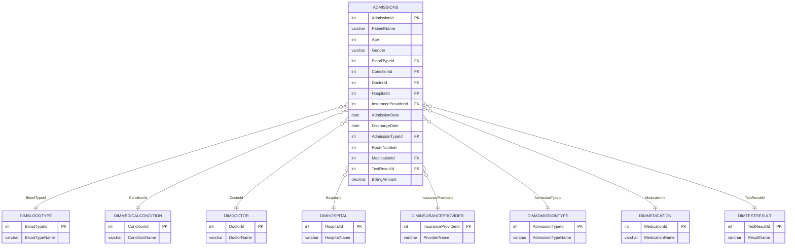

# Entity relationship diagram

A star schema: one fact table, eight dimension tables.

```mermaid
erDiagram
    ADMISSIONS }o--|| DIMBLOODTYPE : "BloodTypeId"
    ADMISSIONS }o--|| DIMMEDICALCONDITION : "ConditionId"
    ADMISSIONS }o--|| DIMDOCTOR : "DoctorId"
    ADMISSIONS }o--|| DIMHOSPITAL : "HospitalId"
    ADMISSIONS }o--|| DIMINSURANCEPROVIDER : "InsuranceProviderId"
    ADMISSIONS }o--|| DIMADMISSIONTYPE : "AdmissionTypeId"
    ADMISSIONS }o--|| DIMMEDICATION : "MedicationId"
    ADMISSIONS }o--|| DIMTESTRESULT : "TestResultId"

    ADMISSIONS {
        int AdmissionId PK
        varchar PatientName
        int Age
        varchar Gender
        int BloodTypeId FK
        int ConditionId FK
        int DoctorId FK
        int HospitalId FK
        int InsuranceProviderId FK
        date AdmissionDate
        date DischargeDate
        int AdmissionTypeId FK
        int RoomNumber
        int MedicationId FK
        int TestResultId FK
        decimal BillingAmount
    }

    DIMBLOODTYPE {
        int BloodTypeId PK
        varchar BloodTypeName
    }

    DIMMEDICALCONDITION {
        int ConditionId PK
        varchar ConditionName
    }

    DIMDOCTOR {
        int DoctorId PK
        varchar DoctorName
    }

    DIMHOSPITAL {
        int HospitalId PK
        varchar HospitalName
    }

    DIMINSURANCEPROVIDER {
        int InsuranceProviderId PK
        varchar ProviderName
    }

    DIMADMISSIONTYPE {
        int AdmissionTypeId PK
        varchar AdmissionTypeName
    }

    DIMMEDICATION {
        int MedicationId PK
        varchar MedicationName
    }

    DIMTESTRESULT {
        int TestResultId PK
        varchar ResultName
    }
```
